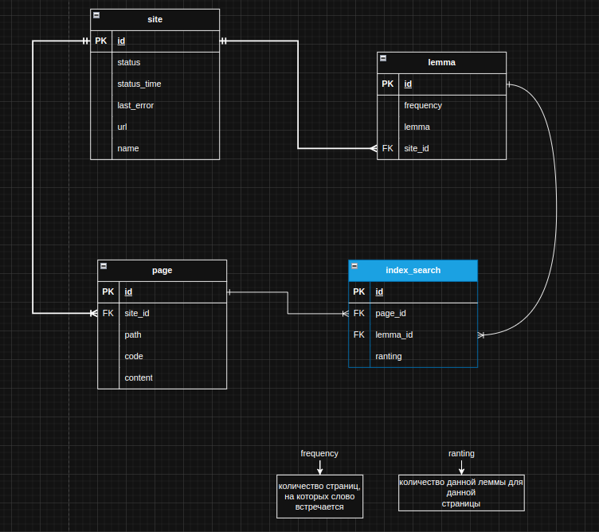

# Поисковый движкок по сайтам (локальный)

## Описание

> Поисковый движок представляет из себя Spring-приложение
(JAR-файл, запускаемый на любом сервере или компьютере), работающее с
> локально установленной базой данных MySQL, имеющее простой
> веб-интерфейс и API, через который им можно управлять и получать
> результаты поисковой выдачи по запросу.

## Как происходит поиск

1. В конфигурационном файле ***application.yaml*** задаем сайты по которым будем осуществлять
   поиск.
2. Стартуем приложение локально ***http://localhost:8080/*** в браузере
3. Запускаем индексацию: приложение начнет индексировать сайты (сайт), т.е.
   обходить все страницы сайта, начиная с главной страницы и сохранять их содержимое в таблицу в базе
   данных

4. После индексации (обхода сайта по всем страницам) будет создан
поисковый индекс (таблица ***index_search*** в БД)