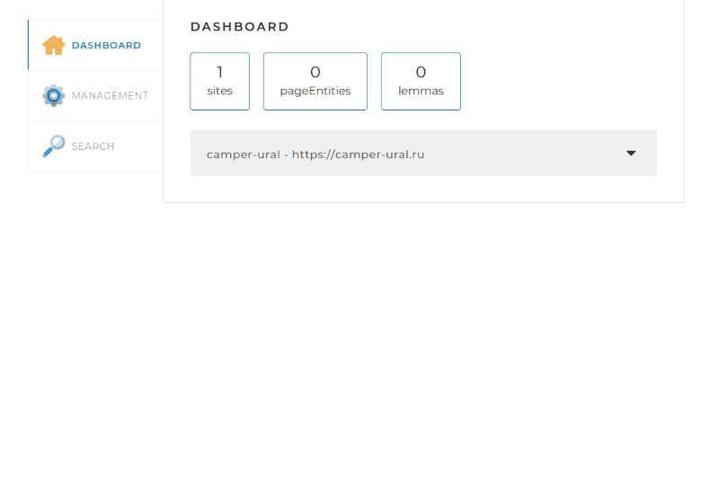
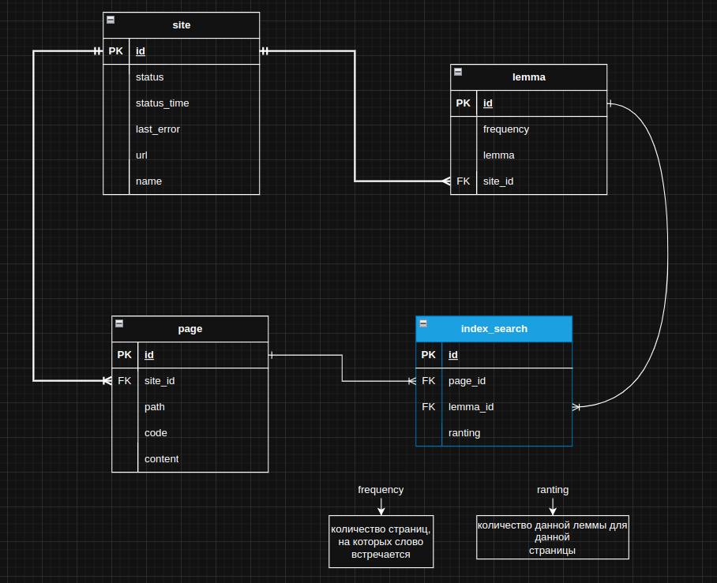
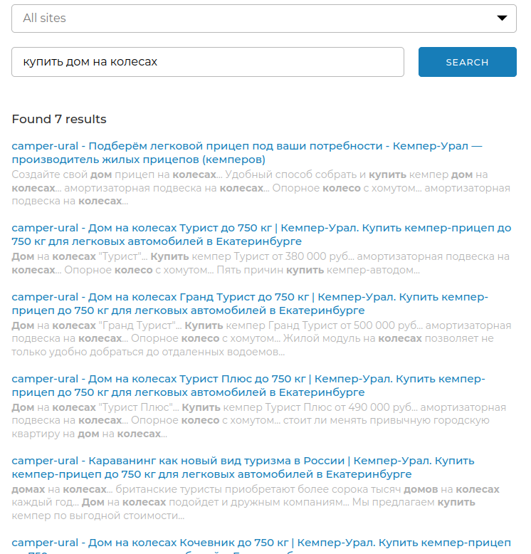
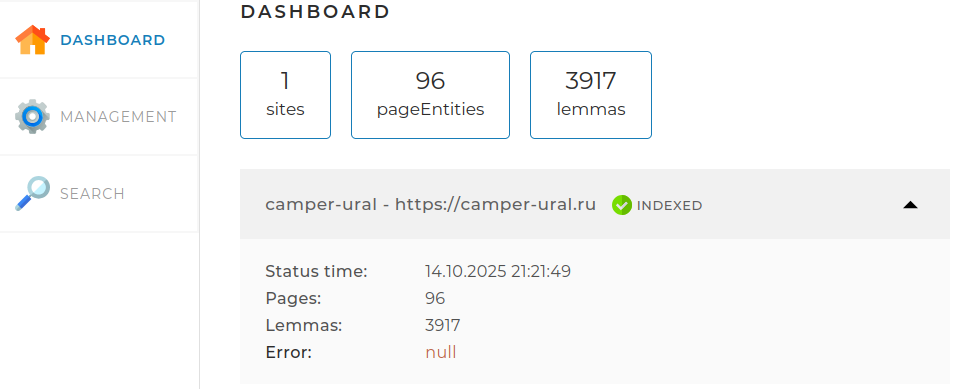

# Поисковый движок по сайтам (локальный)

## Описание

> Поисковый движок представляет из себя Spring-приложение (JAR-файл,запускаемый на любом сервере или компьютере), 
> работающее с локально установленной базой данных MySQL, имеющее простой веб-интерфейс и API,
> через который им можно управлять и получать результаты поисковой выдачи по запросу.

## Как происходит поиск

1. В конфигурационном файле ***application.yaml*** задаем сайты по которым будем осуществлять
   поиск.
2. Запускаем приложение и оно сразу начинает «слушать» порт 8080 и при
   переходе в браузере по адресу ***http://localhost:8080/*** начинает
   открываться главная страница приложения
3. Запускаем индексацию: приложение начнет индексировать сайты (сайт), т.е.
   обходить все страницы сайта, начиная с главной страницы и сохранять их содержимое в таблицы в базе
   данных. Схема БД на скрине ниже

  

[//]: # (
)

[//]: # ()

[//]: # (
)

4. После индексации (обхода сайта по всем страницам) будет создан
поисковый индекс (таблица ***index_search*** в БД)
5. В программе реализована возможность после выполнения полной индексации проиндексировать\
   (обновить) отдельную страницу, не теряя результатов полной индексации

6. Запускаем поиск фразы (фрагмента текста) который хотим найти на сайте (сайтах). В результате будут
выданы ссылки на страницы со сниппетами, в которых встречается эта фраза (сниппеты будут отсортированы по убыванию релевантности).
Также в конфигурационном файле задаем лимит на выдачу найденных страниц

7. Также на странице можем посмотреть статистику после индексации сайта (сайтов)

## Используемые технологии в проекте
* Приложение **Spring**
* Сборщик **Maven**
* Лемматизатор **Apache.lucene.morphology**
* Библиотека **JSOUP**
* Шаблонизатор **Thymeleaf**
* Библиотека **Lombok**
* Библиотека **ModelMapper**
* База данных **MySql**
* Пул потоков **ForkJoinPool** (многопоточность)
* Регулярные выражения **Regex**